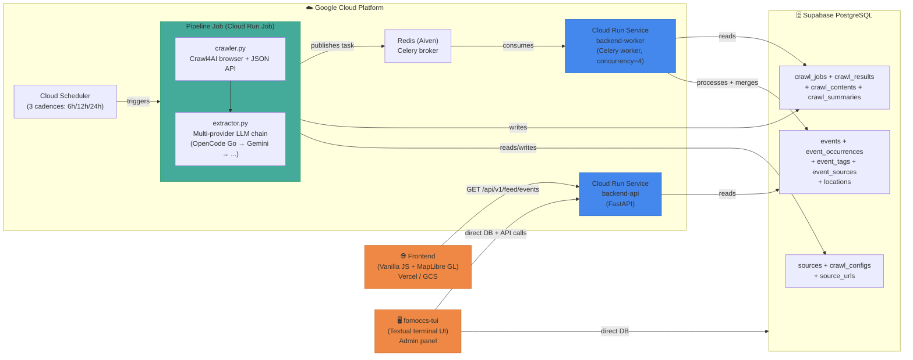

# FomoCCS — Event Discovery Platform (Caracas)

Crawls event websites, extracts structured data with LLMs, and serves an interactive map of events in Caracas.

## Architecture



## Components

| Component | Directory | Tech | Purpose |
|-----------|-----------|------|---------|
| **Pipeline** | `pipeline/` | Python 3.12, Crawl4AI, LLMs | Crawl event websites, extract structured events via multi-provider LLM chain |
| **Backend API** | `backend/api/` | Python 3.14, FastAPI, SQLAlchemy | REST API for frontend, post-extraction processing (dedup, merge, geocoding) |
| **Backend Worker** | `backend/api/tasks/` | Celery + Redis | Async processing: parse extracted events, deduplicate, geocode |
| **Admin TUI** | `backend/tui/` | Python 3.14, Textual | Terminal admin panel: manage sources, events, locations, tag rules |
| **Frontend** | `src/` | Vanilla JS, MapLibre GL | Interactive map of Caracas with event filtering, dark/light theme |
| **Infrastructure** | `infrastructure/` | Terraform | GCP: Cloud Run, Cloud SQL, Artifact Registry, Cloud Scheduler, GCS |

## Quick Links

- [Architecture deep dive](docs/architecture.md)
- [Pipeline deep dive](docs/pipeline-deep-dive.md)
- [Adding a new source](docs/adding-a-source.md)
- [TUI guide](docs/tui-guide.md)
- [Deployment](docs/deployment.md)
- [Source configuration reference](INSTRUCTIONS.md)

## Local Development

```bash
# Backend (API + TUI)
cd backend && uv sync
fomoccs-tui                    # Launch admin TUI

# Pipeline (requires Chromium)
cd pipeline && uv sync
python main.py --ids 123       # Crawl specific source

# Frontend
npm install && npm run build   # Build to dist/
npm run dev                    # Dev server

# Infrastructure
cd infrastructure
terraform init && terraform plan
```
